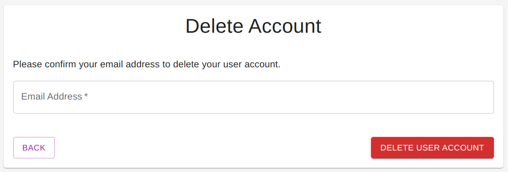

## Overview

UserDelete is a form component for the current user to delete their account. It is linked from the UserProfile component. After the account is successfully deleted, the user will no longer be in the signed-in state and will be redirected back to the homepage.

## Screenshot

## Props

| Prop Name | Description |
| --- | --- |
| pathnames | The JSON contains the components and their path names for navigation links |

## Source Code

[https://github.com/fireactjs/core/blob/main/src/lib/components/user/UserDelete.js](https://github.com/fireactjs/core/blob/main/src/lib/components/user/UserDelete.js)