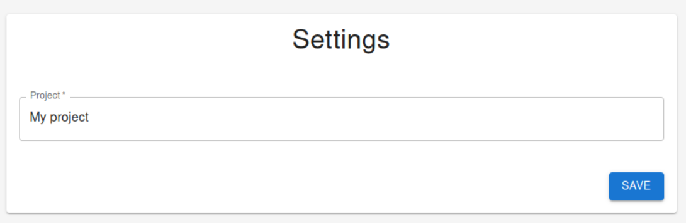

## Overview

This component is designed to be the component to change the subscription account settings. The component updates the subscription account name. When you build your SaaS application, you should replace this component with your own custom build component if the subscription settings are more than just the account name. For example, if your SaaS is a no-code web application builder, you might have other settings such as domain.

## Screenshot

## Source Code

[https://github.com/fireactjs/saas/blob/main/dist/components/Settings.js](https://github.com/fireactjs/saas/blob/main/dist/components/Settings.js)