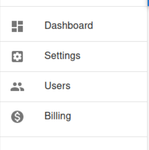

## Overview

This is the menu component to display the main menu for the subscription account. By default, it contains Dashboard, Settings, Users and Billing. You can add other menu item components by adding them to the `customItems` prop.

## Screenshot

## Props

| Prop Name | Description |
| --- | --- |
| customItems | custom menu item components to be inserted between Dashboard and Settings |

## Source Code

[https://github.com/fireactjs/saas/blob/main/dist/components/SubscriptionMenu.js](https://github.com/fireactjs/saas/blob/main/dist/components/SubscriptionMenu.js)